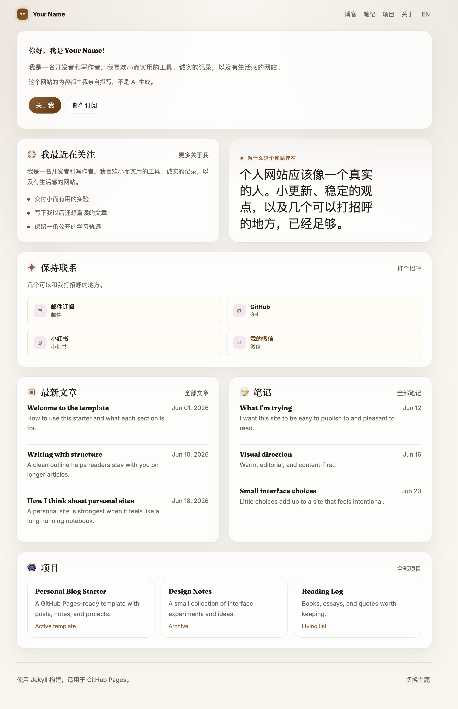
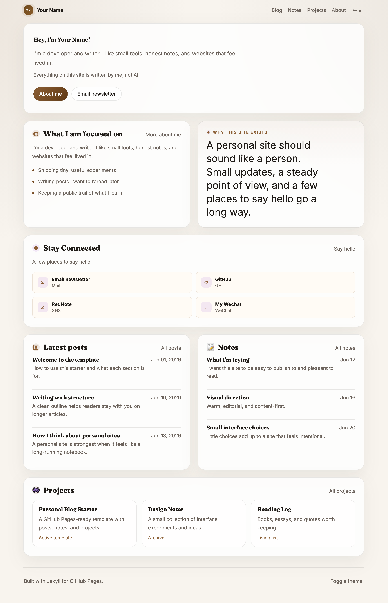

# GitHub Pages 博客模板

一个偏温暖、内容优先的个人博客模板，适合部署到 GitHub Pages。

## 效果图





## 亮点

- 更像个人写作网站的首页
- 中英文界面切换
- 明暗主题切换
- 博客、笔记、项目三个内容区块
- 可编辑的 About 页面和个人资料数据
- 响应式布局，手机和桌面都适配
- 不依赖 GitHub Pages 不支持的自定义插件

## 包含内容

- `index.html` 首页
- `about.md`、`blog.md`、`notes.md`、`projects.md`
- `_posts/` 用于长文文章
- `_notes/` 用于短笔记、实验和片段
- `_projects/` 用于项目页面
- `_data/profile.yml` 用于个人文案和链接
- `assets/css/main.css` 用于视觉样式
- `assets/js/theme.js` 用于主题和语言切换

## 快速开始

1. Fork 或 clone 这个仓库。
2. 编辑 `_config.yml`，填入站点标题和描述。
3. 编辑 `_data/profile.yml`，修改姓名、简介、当前关注和链接。
4. 替换 `_posts`、`_notes`、`_projects` 和 `about.md` 里的示例内容。
5. 如果你想改栏目，也可以调整首页模块和导航。
6. 在 GitHub 仓库设置里开启 GitHub Pages。

## 部署到 GitHub Pages

1. 把这个仓库推送到 GitHub。
2. 打开仓库的 `Settings` > `Pages`。
3. 在 `Build and deployment` 里，把 `Source` 设为 `Deploy from a branch`。
4. 选择要发布的分支，通常是 `main`，目录选 `/ (root)`。
5. 保存设置，等待 GitHub 完成发布。
6. 如果你要使用自定义域名，也可以在同一个 `Pages` 页面里配置。

如果第一次构建失败，可以去 `Actions` 页面查看构建日志。

## 个性化建议

- 在 `assets/css/main.css` 里调整颜色和间距
- 改 logo、图标和卡片样式，让它更像你自己的品牌
- 重写首页和 About 页文案，让语言更有个人感
- 保留或替换 `RedNote` 和 `My Wechat` 卡片
- `current` 列表尽量短一点，保持具体
- 可以在 `_layouts/home.html` 里增删首页区块

## 内容结构

- `_posts/` 存放长文章
- `_notes/` 存放短笔记和实验
- `_projects/` 存放项目页面
- `about.md` 存放个人简介和联系信息
- `archive.md` 提供内容总览

## 本地预览

先安装依赖，再本地运行 Jekyll：

```bash
bundle install
bundle exec jekyll serve
```

然后打开 `http://localhost:4000`。

如果你的 Ruby 版本和依赖不兼容，可以使用 `rbenv` 或 `asdf` 管理版本。

## 说明

- 这个模板已经刻意移除了 RSS。
- 语言切换是前端实现的，会记住你上一次选择。
- 主题切换也会记住你上一次选择。

## English

See [README.md](./README.md).
